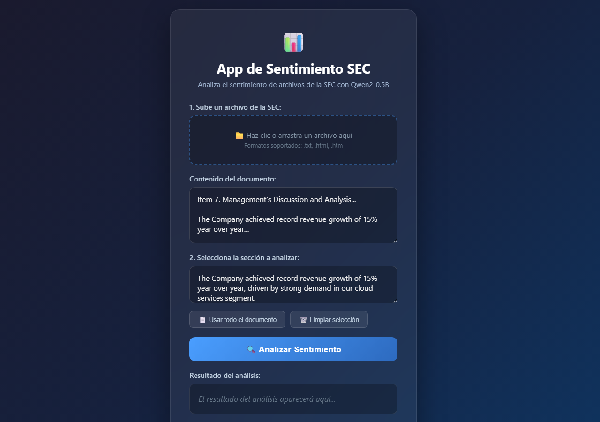

# App de Sentimiento SEC

Aplicación web para analizar el sentimiento de archivos de la SEC (Securities and Exchange Commission) utilizando el modelo de lenguaje **Qwen2-0.5B-Instruct**.

El modelo corre directamente en el navegador gracias a **Transformers.js**, sin necesidad de backend ni servidor.

## Demo en vivo

[https://luislozanom.github.io/app_sentimiento_sec/](https://luislozanom.github.io/app_sentimiento_sec/)

Simplemente abre el enlace de arriba en tu navegador. La primera vez se descarga el modelo (~300 MB) y después queda en caché.

## Screenshot



## Funcionalidades

1. **Subir archivos de la SEC**: Soporta formatos `.txt`, `.html` y `.htm`.
2. **Seleccionar sección**: Visualiza el contenido completo y selecciona la sección que deseas analizar.
3. **Análisis de sentimiento**: El LLM determina si el sentimiento es **Positivo**, **Negativo** o **Neutral**.
4. **Razón del sentimiento**: Obtén una breve explicación en español del porqué de esa clasificación.
5. **100% local**: Todo el procesamiento ocurre en tu navegador. No se envía información a servidores externos.

## Uso local con Python (alternativa)

También se incluye `app.py` para correr el modelo localmente con Flask:

```bash
git clone https://github.com/LuisLozanoM/app_sentimiento_sec.git
cd app_sentimiento_sec
pip install flask transformers torch
python app.py
```

Abrir en el navegador: [http://localhost:5000](http://localhost:5000)

## Estructura del proyecto

```
app_sentimiento_sec/
├── app.py          # Backend Flask (alternativa local con Python)
├── index.html      # Frontend con Transformers.js (funciona en GitHub Pages)
└── README.md
```

## Tecnologías

- **Frontend**: HTML, CSS, JavaScript (vanilla)
- **Modelo en navegador**: Transformers.js, ONNX Runtime Web
- **Modelo**: Qwen2.5-0.5B-Instruct en formato ONNX cuantizado (q4)
- **Backend local (opcional)**: Python, Flask, Hugging Face Transformers, PyTorch

## Nota

La precisión del análisis de sentimiento depende del modelo de 0.5B parámetros. Este proyecto tiene fines educativos y de demostración.
